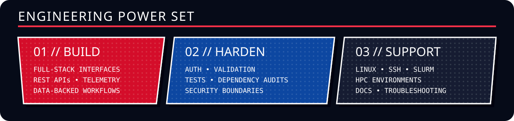
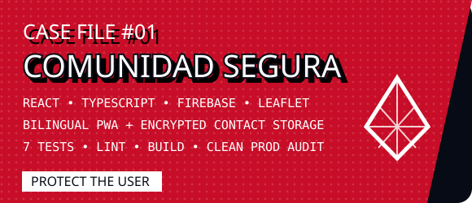
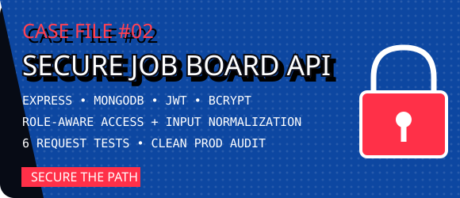
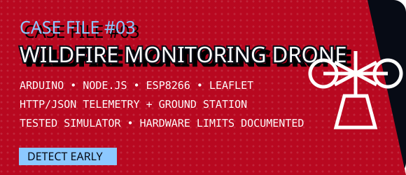
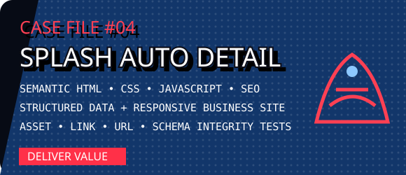
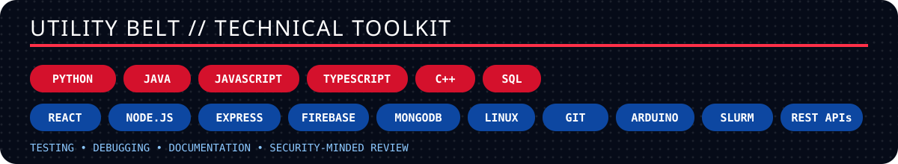

<div align="center">
  

  <br />

  <a href="https://www.linkedin.com/in/david-de-santiago-a485b4240/"></a>
  <a href="mailto:ddesantiago@ucsd.edu"></a>
  

  <h3>UC San Diego student building reliable software across product, infrastructure, and hardware boundaries.</h3>
</div>



I turn practical problems into usable systems, then test the edge cases, document the boundaries, and make the result easier for the next person to operate. If something is a prototype, simulator, or planned integration, I say so.

## 🕸️ Selected missions

<div align="center">
  <a href="https://github.com/ddesantiag0/comunidad-segura"></a>
  <a href="https://github.com/ddesantiag0/secure-job-board-api"></a>
  <br />
  <a href="https://github.com/ddesantiag0/WildfireMonitoringDrone"></a>
  <a href="https://github.com/ddesantiag0/splash-auto-detail"></a>
</div>

<details>
  <summary><strong>Open the mission reports</strong></summary>
  <br />

  - **Comunidad Segura:** Removed browser-exposed messaging credentials, escaped report content used in map popups, added route-level code splitting, and passed 7 automated tests, lint, build, and a production audit.
  - **Secure Job Board API:** Prevented public administrator self-assignment, normalized authentication input, separated app construction from database startup, and passed 6 request-level tests.
  - **Wildfire Monitoring Drone:** Built valid HTTP/JSON telemetry, a ground-station API, NDJSON logging, Leaflet dashboard, and hardware-free simulator. Physical hardware validation remains documented.
  - **Splash Auto Detail:** Built a responsive business site with structured data and local-search documentation; removed broken assets and unsupported claims; added integrity tests.
</details>

## ⚡ Field experience

> ### San Diego Supercomputer Center · Expanse
> Supported PhD researchers and technical professionals during hands-on HPC sessions. Assisted with **Linux, SSH, SLURM, software environments, and real-time troubleshooting** of computational workflows.



## 🕷️ Operating principle

```text
SENSE the real problem
BUILD the smallest useful system
TEST where it can fail
DOCUMENT what is true
IMPROVE what users feel
```

<div align="center">
  <strong>Software engineering · AI-enabled systems · Infrastructure · QA / IT</strong>
  <br />
  <sub>With great code comes great responsibility.</sub>
</div>

<details>
  <summary><strong>Coursework and project history</strong></summary>
  <br />
  Older lab, starter, and homework repositories are retained as academic history. They are not presented as production applications or solo work when the project was collaborative.
</details>
