<div align="center">
  

  <h3>I turn practical problems into tested, documented systems.</h3>

  <p>
    UC San Diego student · Software Engineering · AI-Enabled Systems · Infrastructure · QA / IT
  </p>

  <p>
    <a href="https://www.linkedin.com/in/david-de-santiago-a485b4240/">LinkedIn</a>
    &nbsp;•&nbsp;
    <a href="mailto:ddesantiago@ucsd.edu">Email</a>
    &nbsp;•&nbsp;
    Open to internships and early-career technical roles
  </p>
</div>

---

### What I bring

| Build | Harden | Support |
| :--- | :--- | :--- |
| Full-stack interfaces, REST APIs, embedded telemetry, and data-backed workflows | Input validation, authentication boundaries, dependency audits, and automated tests | Linux, SSH, SLURM, HPC environments, documentation, and real-time troubleshooting |

I enjoy work that crosses boundaries: software and hardware, product and infrastructure, implementation and user support. My projects are documented with honest limitations—if something is a prototype, simulator, or planned integration, I say so.

### Selected work

| Project | What it demonstrates | Evidence |
| :--- | :--- | :--- |
| **[Comunidad Segura](https://github.com/ddesantiag0/comunidad-segura)** | Bilingual React/TypeScript safety prototype with Firebase reports, Leaflet maps, PWA support, notifications, and locally encrypted contact storage | Removed exposed messaging credentials, escaped map content, added code splitting, and passed **7 tests**, lint, build, and production audit |
| **[Secure Job Board API](https://github.com/ddesantiag0/secure-job-board-api)** | Express/MongoDB API with JWT authorization, bcrypt, role-aware access, Helmet, CORS, and throttling | Blocked public administrator self-assignment, normalized auth input, separated startup concerns, and passed **6 request-level tests** |
| **[Wildfire Monitoring Drone](https://github.com/ddesantiag0/WildfireMonitoringDrone)** | Arduino-to-Node telemetry pipeline with an ESP8266 interface, ground-station API, NDJSON logs, dashboard, and simulator | Produces valid HTTP/JSON telemetry; automated ground-station tests and live simulator path pass; hardware validation remains clearly documented |
| **[Splash Auto Detail](https://github.com/ddesantiag0/splash-auto-detail)** | Responsive small-business website with semantic HTML, modern CSS, structured data, sitemap, and local-search documentation | Removed broken assets and unsupported claims; integrity tests verify assets, links, URLs, and structured data |

### Field experience

At the **San Diego Supercomputer Center**, I supported PhD researchers and technical professionals during hands-on sessions on the **Expanse supercomputer**. I assisted with Linux, SSH, SLURM, software environments, and troubleshooting computational workflows in real time.

### Technical toolkit

```text
Languages       Python · Java · JavaScript · TypeScript · C++ · C · SQL
Web & APIs      React · Node.js · Express · Firebase · MongoDB · HTML · CSS
Systems         Linux · Git · REST APIs · Arduino · SystemVerilog · SLURM
Working style   Testing · Debugging · Documentation · Security-minded review
```

### Engineering mode

```js
while (problem.isReal()) {
  understand();
  build();
  test();
  document();
  improve();
}
```

<details>
  <summary><strong>Coursework and project history</strong></summary>
  <br />
  Older lab, starter, and homework repositories are retained as academic history. They are not presented as production applications or solo work when the project was collaborative.
</details>
